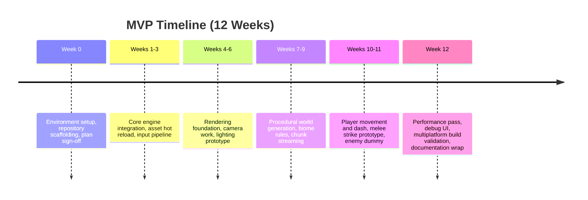

# VibeCoded Game MVP Plan

## Framing the Effort
This roadmap assumes a single full-time developer who is already comfortable with Rust, the Bevy engine, shader authoring in WGSL, and procedural generation techniques. If the team is smaller, part-time, or still climbing the learning curve, expect to extend the schedule or reduce scope accordingly.

The vision is to craft a playable top-down ARPG prototype that blends Octopath-style HD-2D aesthetics with the brisk combat feel of *A Link to the Past*. The MVP should let players roam a procedurally generated overworld, swing a basic melee attack, and take in atmospheric lighting that bridges 2D sprites with subtle 3D depth. Narrative content, persistence, advanced combat systems, and polish remain outside the first release.

## What Success Looks Like
The prototype succeeds when it can render layered sprites in a 3D-lit scene at a steady 60 FPS on macOS or Linux dev hardware, while also cross-compiling cleanly to Windows. Controls must feel responsive: movement, dash, and a single melee attack should read clearly, register hits, and respect collision boundaries. The world around the hero should appear endless, generated on the fly with distinct biome flavors and traversal challenges. Finally, the build pipeline needs to collapse to a single command per platform, backed by clear documentation.

## Technical Backbone
Bevy (Rust + WGPU) anchors the project, giving us ECS structure, cross-platform rendering, and an active plugin ecosystem. A `rust-toolchain.toml` file will pin the stable Rust release, ensuring reproducible builds. The HD-2D look demands a custom rendering pipeline that mixes sprite billboarding, lightweight tile meshes, and deferred-style lighting. Procedural terrain will lean on noise functions and biome layering, while runtime chunk management keeps memory in check. Supporting tools include `cargo` workflows, `tracing` for observability, `bevy_egui` for debug overlays, and GitHub Actions to keep the CI loop tight.

## Workstreams at a Glance
The **Rendering & Visuals** stream focuses on camera logic, sprite layering, and lighting effects that sell the HD-2D illusion. **World Systems** handles the data backbone: map structures, generators, and collision surfaces. **Gameplay & Controls** stitches in movement, combat prototypes, and physics interactions. **Tooling & Build** ensures the repo is organized, assets flow smoothly, and builds remain predictable. **Production Support** keeps documentation, profiling, and art integration practices ready for expansion.

## MVP Timeline
Discovery and build-out run for twelve weeks in this baseline, though the assumption about developer experience means there is little slack. Each milestone feeds the next, with render and world systems maturing before gameplay layers in. A high-level view:

## Key Deliverables
By the end of the cycle, the repository should expose a modular Bevy project with the rendering pipeline, world-generation module, and gameplay prototype all compiled together. The procedural world library must expose tunable parameters so designers can shape biome behavior. The HD-2D shader suite needs demonstrable assets that showcase lighting and depth. Documentation ties it all together with setup steps, architectural overviews, and suggestions for subsequent roadmap items.

## Risks Worth Watching
**Visual complexity** can quickly consume time if the lighting pass underperforms; the mitigation is to start with minimal effects, profile frequently, and iterate shaders only after the baseline runs smoothly. **Procedural generation scope creep** threatens to extend the schedule, so the MVP defaults to two or three biome archetypes with room to expand later. **Cross-platform builds** often bite late in the project, hence early automation with tools like `cross` and clearly documented Windows setup. Finally, **asset creation** for HD-2D is non-trivial: placeholder sprites with normal maps will keep velocity up while the art pipeline matures.

## Immediate Next Moves
Initialize the Cargo project and commit the agreed directory structure. Add the toolchain pin, linting (`cargo fmt`, `clippy`), and CI scaffolding. Capture detailed specs for art, biome behavior, and combat feel so contributors share a single language. With that groundwork laid, the team can pull tasks into the first sprint and begin delivering the core loops.
