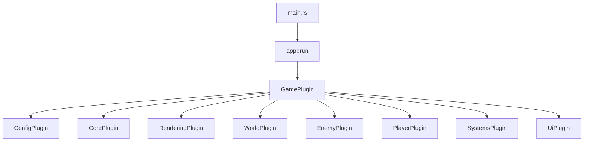

# Architecture Overview

This document summarizes the current architecture of the VibeCoded Game MVP. It focuses on the modules that are implemented today, explains their responsibilities, and outlines key data flows so new contributors can get oriented quickly.

## High-Level App Composition

The binary entry point (`src/main.rs`) delegates to `app::run()`, which wires up Bevy's `App` with a curated plugin stack:

Each plugin encapsulates a feature domain and registers its own systems, resources, and assets.

## Module Responsibilities

### `config` (`src/config/`)
- **`AppConfig` resource**: Stores window metadata (title, etc.).
- **`ConfigPlugin`**: Initializes `AppConfig` and applies window title updates via `configure_window()` during startup.

### `core` (`src/core/`)
- **`CameraPlugin`** (`camera.rs`): Sets up `CameraSettings`/`CameraState` resources, spawns the `Camera2dBundle`, and manages follow & shake systems (`toggle_follow`, `follow_player`, `apply_shake`).
- **`InputPlugin`** (`input.rs`): Maps keyboard input into the `InputState` resource each frame, including movement vector, dash, attack, and debug toggles.
- **`TimePlugin`** (`time.rs`): Provides a global `TimeScale` multiplier resource used by movement and AI to scale delta time.

### `rendering` (`src/rendering/`)
- Currently a placeholder plugin preparing the rendering layer for future post-processing and lighting work. The module sets up the render pipeline scaffolding but defers advanced effects.

### `world` (`src/world/`)
- **`ChunkPlugin`** (`world/chunk.rs`): Defines chunk coordinate structures, manages the `WorldChunks` map, and offers helpers for layer data.
- **`TilesPlugin`** (`world/tiles.rs`): Registers tile definitions (`TileRegistry`) describing walkability and names used by debug overlays.
- **`GenerationPlugin`** (`world/generation/mod.rs`): Initializes `WorldSeed`, `NoiseSettings`, and other terrain resources; adds `TerrainPlugin` for procedural chunk generation.
- **`TerrainPlugin`** (`world/generation/terrain.rs`): Generates visible chunks around the player with multi-octave noise, updates `ChunkDebugStats`, and prunes distant chunks. Emits log metrics for debugging.
- **`Debug` module** (`world/debug.rs`): Manages `DebugTerrainSettings`, pools chunk overlay sprites, and tracks per-frame/cumulative chunk metrics.

### `player` (`src/player/`)
- **`PlayerPlugin`**: Includes `ControllerPlugin` (spawns placeholder sprite, assigns `PlayerEntity` marker) and `AnimationPlugin` stub.
- **`MovementState` integration**: The movement systems in `systems/movement.rs` attach and update the player's velocity, dash state, and desired translation each frame.

### `enemy` (`src/enemy/mod.rs`)
- **`EnemyPlugin`**: Spawns a dummy enemy with `MovementState` and runs `enemy_chase_player()` to follow the player using `TimeScale` for consistent movement.
- Serves as a foundation for future AI and combat interactions.

### `systems` (`src/systems/`)
- **`MovementPlugin`**: Handles player `MovementState` updates, dash logic, and smoothing (`update_dash_and_velocity`).
- **`CollisionPlugin`** (`collisions.rs`): Resolves tile collisions by clamping translation when a blocked tile is encountered via `WorldChunks` and `TileRegistry` lookups.
- Additional submodules can register to `SystemsPlugin` to orchestrate gameplay systems ordering.

### `ui` (`src/ui/debug_overlay.rs`)
- **`DebugOverlayPlugin`**: Builds a Bevy UI HUD showing collision status, tile info, debug toggle state, and chunk streaming metrics. It synchronizes with `InputState`, `MovementState`, `DebugTerrainSettings`, and `ChunkDebugStats` resources.

## Key Data Flows

### Input → Movement → Collision
1. `InputPlugin` updates `InputState` with direction and actions.
2. `MovementPlugin` reads `InputState` to calculate `MovementState.desired_translation` and `velocity`.
3. `CollisionPlugin` checks proposed movement against chunk colliders via `WorldChunks::tile_at_world()`. If the target tile is non-walkable, it zeroes velocity/translation and sets `blocked`, which the HUD reports.
4. Camera shake can be triggered when dash events occur (`CameraState.desired_shake`).

### Chunk Streaming Pipeline
1. `TerrainPlugin::generate_visible_chunks()` locates the player's current chunk, iterates within `TerrainSettings.view_radius`, and ensures each chunk is generated or refreshed if marked dirty.
2. Newly generated or updated chunks increment counters in `ChunkDebugStats`; removed chunks also update totals.
3. `WorldDebugPlugin` resets per-frame stats each `PreUpdate` and spawns or hides debug sprites based on `DebugTerrainSettings.show_tiles`.
4. `DebugOverlayPlugin` reads the stats and settings to present runtime diagnostics.

### Enemy Tracking Loop
1. `EnemyPlugin` spawns an enemy entity with `MovementState`.
2. `enemy_chase_player()` runs during `Update`, computing a normalized direction toward the player and populating `MovementState.desired_translation`.
3. Because collisions operate on all entities with `MovementState`, enemies benefit from the same tile collision handling as the player.

## Resources & Configuration Summary

- **`AppConfig`** (window title)
- **`CameraSettings` / `CameraState`** (follow damping, shake properties)
- **`InputState`** (movement, dash, attack toggles)
- **`TimeScale`** (global time multiplier)
- **`WorldSeed`**, **`NoiseSettings`**, **`TerrainSettings`** (world generation parameters)
- **`DebugTerrainSettings`**, **`ChunkDebugStats`** (debug visualization toggles & metrics)
- **`TileRegistry`** (tile metadata including walkability)

## Outstanding & Planned Work

- Rendering: HD-2D pipeline, post-processing, and asset workflows are placeholders awaiting implementation in `rendering/` and associated systems.
- World: Biome classification, async chunk generation, navigation data, and physics-backed collider extraction remain open tasks.
- Gameplay: Combat prototype and enemy behavior loops are partially scaffolded but not feature-complete.
- Systems/UI: Debug UI sliders, physics integration, and telemetry/tracing are tracked in `docs/MVP_TASKS.md` as future steps.

## Contributing

- Run `cargo fmt` and `cargo check` before pushing changes. CI (`.github/workflows/ci.yml`) enforces formatting, linting, and smoke builds across platforms.
- Use the debug overlay (`V` hotkey) to inspect tile info and chunk performance when testing world or movement changes.
- When introducing new modules, register their plugins within `GamePlugin` in `src/app.rs` to ensure they participate in the app lifecycle.

For more granular task tracking and future work, refer to `docs/MVP_TASKS.md` and `docs/MVP_PLAN.md`.
